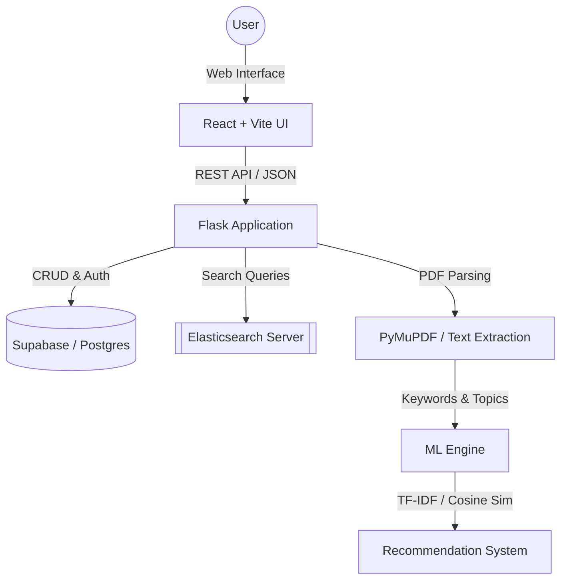

# Intelligent Knowledge Management System (IKMS) 🚀


A premium, AI-powered platform designed to centralize, manage, and discover academic and institutional research. IKMS leverages modern NLP and Full-Text search to provide a state-of-the-art experience for researchers and institutions.

---

## 🌟 Key Features

- **🧠 AI-Driven Metadata Extraction**: Automatically extracts abstracts, keywords, and topics from uploaded PDFs using spaCy and TF-IDF logic.
- **🔍 Advanced Master Search**: Full-text search with relevancy ranking and filtering powered by **Elasticsearch**.
- **📊 Researcher Mission Control**: A glassmorphism-styled dashboard for researchers to track document impact, views, and citations.
- **🏛️ Institutional Hubs**: Dedicated portals for universities and organizations to manage their research archives and analytics.
- **🛡️ Secure RBAC**: 4-tier Role-Based Access Control (Public, Researcher, Institutional Admin, System Admin).
- **💡 Content Recommendations**: Intelligent suggestions based on document similarity (Cosine Similarity).

---

## 🛠️ Technology Stack

| Component | Technology |
| :--- | :--- |
| **Frontend** | React 18, Vite, Tailwind CSS, Glassmorphism UI |
| **Backend** | Python, Flask, Flask-CORS |
| **Database** | PostgreSQL (hosted on Supabase) |
| **Search Engine** | Elasticsearch 8.x |
| **AI/NLP** | spaCy, Scikit-learn (TF-IDF, LDA) |
| **Auth** | Supabase Auth + JWT |

---

## 📐 System Architecture



---

## 🚀 Installation & Setup

### 1. Prerequisites
- Node.js 18+
- Python 3.10+
- Elasticsearch 8.x (Local or Cloud)

### 2. Backend Setup
```bash
cd backend
pip install -r requirements.txt
# Configure your .env with SUPABASE_URL, SUPABASE_KEY, and ES_HOST
python app.py
```

### 3. Frontend Setup
```bash
cd frontend
npm install
npm run dev
```

### 4. Search Synchronization
To index existing documents into Elasticsearch:
```bash
cd backend
python sync_es.py
```

---

## 📝 Ownership & Permissions

> [!IMPORTANT]
> **Created by: Soreti (Team Leader)**
> **DO NOT MODIFY WITHOUT PERMISSION**
> This project is a proprietary Intelligent Knowledge Management System. All backend logic, AI modules, and UI designs are copyrighted.

---

© 2026 IKMS Project Team. Built with ❤️ for National Research.